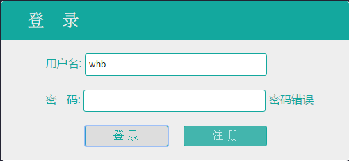

# cloud_note
类似有道云笔记系统。实现框架`Spring/SpringMVC/Mybatis`

## 依赖包 
目前版本的包需要手工导入。本项目包已经存在于`WebRoot/WEB-INF/lib`下，
右击`add Path即可`

### 依赖包展示

### 目录结构

## 关于数据库

需要建立对应的数据表，若无。代码不会报错，只是无法注册。

## 运行

代码运行`Run On Server`后界面

亲测完全可以运行！如有问题请提出，文档后续补充。
